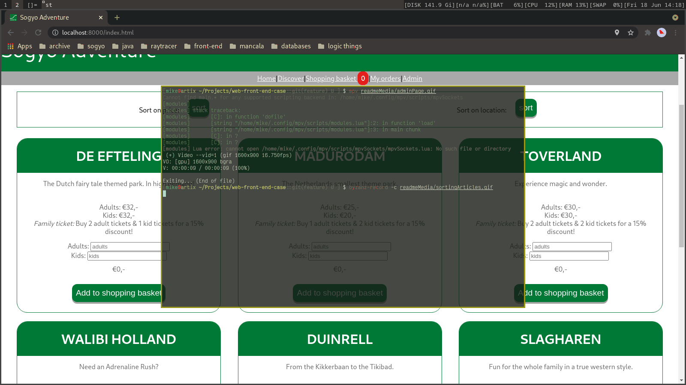
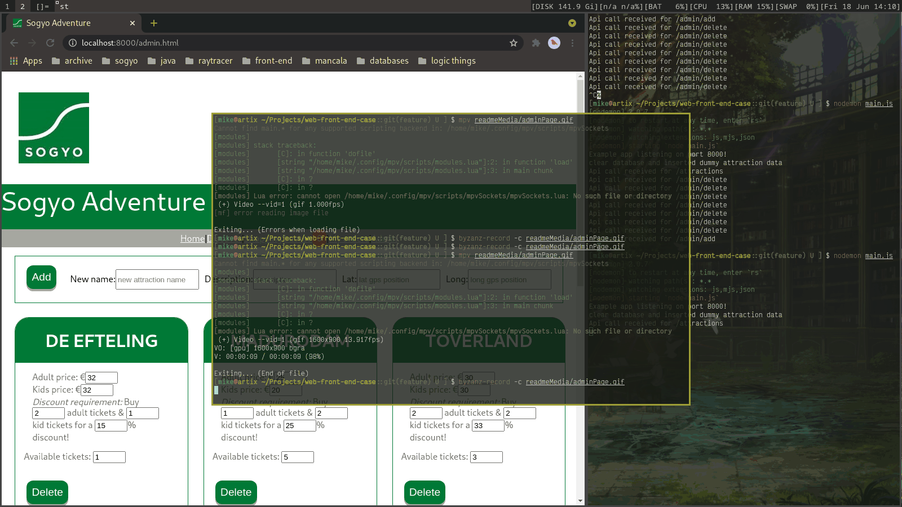

# Front-end of the prototype website

This prototype nodeJS application was used to familiarize ourselves with front end web development using javascript, html, and css. We also implemented a database using a technology of choice, in this case a document database using MongoDB was used.

## Placing orders in shopping basket using localStorage, and then saving order in database

What happens here is that first ground truth attraction is fetched from the
database to be displayed in the dom. When the user tries to input a number of tickets the button is checked against the ground truth (and the localStorage) to see whether tickets are available, otherwise the button is disabled and greyed out.

When a valid order is placed, it is stored in the shoppingbasket or an array in the localStorage. This array of orders is displayed when the user visits the shoppingbasket page, where the user can also dynamically remove an order before paying. In this prototype the actual payment is not implemented, we assume a valid payment and the order is stored in the database. Orders in the database are displayed when visiting the my orders page.

## Sorting of the articles on the main page

Articles on the main page can be sorted using the mean price ((kids + adults)/2) as a key for bubble sort of the attraction objects. Dom tree is manipulated by first removing all attractions and then adding them again in the right order. Users can also sort on location if the browser supports geolocation.

## Responsive design using CSS mediaquery breakpoints

Depending on the size of the screen of your device, if there are articles on the screen, the styling will try to display a proper number of columns of articles/attraction on the screen. The use of flexboxes was also necessary for menu boxes.

## Ordering tickets from a map

There is also a map that uses GPS-coordinates of attractions in the database to display a marker that can be clicked to order tickets for the attraction in the same way as normal.

## Admin page

The admin page can be used to change the data in the database with a graphical user interface. The prices and discount conditions can be updated, a attraction can be removed from the database, and a new attraction can be defined with a name, description, and location.

